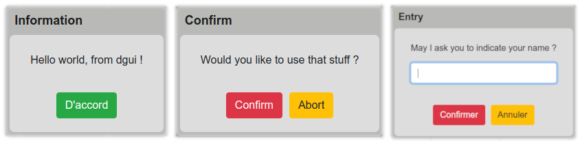
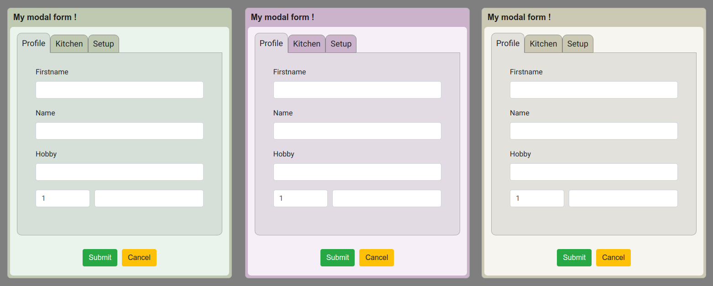
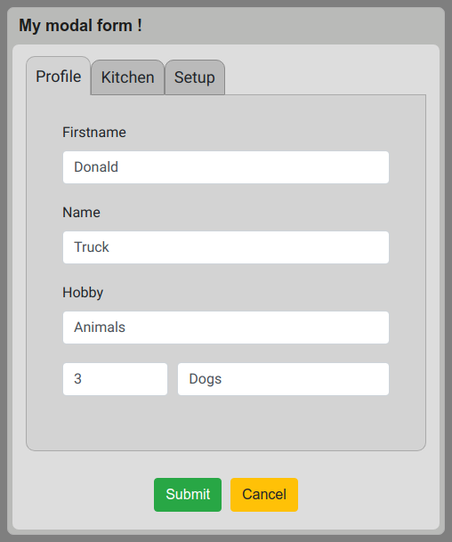
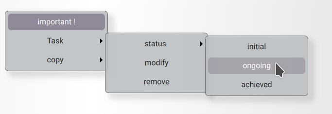

# dGUI - Interface elements generator library including data and events handling

[1. Overview](#1)
<br>
[2. Code examples](#2)

## <a name="1"></a> 1. Overview
### Use cases
* Meteor applications (dGUI was developped in this context)
* All kinds of Webapps
* Cloud computing platforms
### To whom is it addressed ?
* Developpers who want to focus on data and logic rather than graphics
* People who believe in "one task at a time design" philosphy
### Features
* The view is entirely self-generated
* Clean and simple syntax
* A lot of code economy
* integrate well in any kind of environment
* form elements
* MDI elements
* modals
* contextual menus
* (soon) selection tool
* (soon) theming
### Why is dGUI a powerful tool ?
* You write write a few lines, you get the equivalent of hundreds lines of HTML, javascript and CSS code.
* The generated code stays cached only as long as your interface need it.
* Managing server requests can sometimes be very tricky. dGUI makes data control and errors handling easier, leaving you free to process your data and logic at different scales : initialization (conditional fields), formPannel submission, MDI submission... 
* You can easily lay out the content according to which parameters are important in your UI. For instance, you might want to adjust the fields's size only depending on the container's width, or maybe have three fields of same size horizontaly layered (all you have to do is putting them in an array, as described in a further example thereafter).
## <a name="2"></a> 2. Code examples
### Common dialog boxes
```javascript
dgui.alert("Hello world, from dgui !");

dgui.confirm("Would you like to use that stuff ?", "Confirm", (ans) => {
  if(ans.value) { dgui.alert("Thank you !"); }
});

dgui.prompt("May I ask you to indicate your name ?", "Entry", (ans) => {
  dgui.alert("Hello " + ans.value);
});

```


### Easy coloring
```javascript
dgui.modalForm({
  title: "My modal form !",
  MDI: {
    sections: [
      {key: "profile", label: "Profile", fields: [
        {key: "firstname", label: "Firstname"},
        {key: "name", label: "Name"},
        {key: "hobby", label: "Hobby"},
        [{type: "quantity", key: "quantity", size: 1},
        {key: "pet", size: 2}]
      ]},
      {key: "kitchen", label: "Kitchen"},
      {key: "setup", label: "Setup"}
    ],
    options: {containerWidth: 450, containerHeight: 400}
    //You can set just one color and dGUI will do the rest !
  }, options: {color: "#f7f5ef"}
}, (form) => {
  form.end();
});
```

### Modal and MDI
```javascript
dgui.modalForm({
  title: "My modal form !",
  MDI: {
    sections: [
      {key: "profile", label: "Profile", fields: [
        /* if not specified, default field type is "text" */
        {key: "firstname", label: "Firstname"},
        {key: "name", label: "Name"},
        {key: "hobby", label: "Hobby"},
        /* By embedding fields in arrays, you can layer them horizontally*/
        [{type: "quantity", key: "quantity", size: 1},
        /* label attribut is optional */
        /* size attribut sets field's width proportionnaly (ratio 2/3) */
        {key: "pet", size: 2}]
      ]},
      {key: "kitchen", label: "Kitchen"},
      {key: "setup", label: "Setup"}
    ],
    options: {menuLayout: "horizontal", containerWidth: 450, containerHeight: 400}
  }
}, (form) => {
  let data = form.value;
  /* You can access data using key attribut values */
  console.log(data);
  if(data.profile.firstname == "Donald") {
    dgui.alert("Yuck !");
    /* Close the modal */
    form.end();
  }
});
```


### Contextmenus
```javascript
html_element.addEventListener("contextmenu", (e) => {
  e.preventDefault();   /* disable the default contextmenu */
  dgui.contextMenu(e, {
    fields: [
      {key: "important", label: "important !", type: "switch", switchLock: true, action: (target_elm, bool) => {
        /* Instructions */
      }},
      {key: "task", label: "Task", contextMenu: {
        fields: [         
          /* You can conditionally display menu items */
          {label: "New task", condition: false, action: (target_elm) => { t.task(target_elm, "add", note.title) }},
          {label: "status", contextMenu: {
            fields: [
              {key: "initial", label: "initial", group: "task", action: (key) => { /* Instructions */ }},
              {key: "ongoing", label: "ongoing", group: "task", action: (key) => { /* Instructions */ }},
              {key: "achieved", label: "achieved", group: "task", action: (key) => { /* Instructions */ }}
            ]
          }},
          {label: "modify", action: (target_elm) => { t.task(target_elm, "edit", null, note.task) }},
          {label: "remove", action: (target_elm) => { 
            dgui.confirm("Are you sure you want to remove this task ?", "Remove task", (res) => {
              if(res) { Some_Function_To_Delete(target_elm.dataset.id); }
            });
           }}
        ]}
      },
      {label: "copy", contextMenu: {
        fields: [
          {label: "content", action: (target_elm) => {
            let target_id =  target_elm.dataset.id;
            let target = document.getElementById(target_id);
            /* dGUI provides some usefull functions */
            dgui.copyToClipboard(target.innerHTML);
          }}
        ]}
      }
    ], options: {initPosition: "mouse"}
  }, (feedback) => {
    /* You can also get the data from here, especially if your menu contains switches */
  });
});
```
