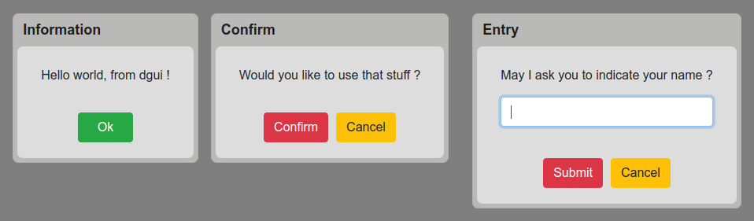

# dGUI - Interface elements generator library including data and events handling

## Use cases
* Meteor applications (dGUI was developped in this context)
* Webapps
* Cloud computing platforms
## To whom is it addressed ?
* Developpers who want to focus on data and logic rather than graphics
* People who believe in "one task at a time design" philosphy
## Features
* View is entirely self-generated
* Clean and simple syntax
* A lot of code economy
* integrate well in any kind of environment
* form elements
* MDI elements
* modals
* contextual menus
* (soon) selection tool
* (soon) theming
## Code examples
### Common dialog boxes
```javascript
dgui.alert("Hello world, from dgui !");

dgui.confirm("Would you like to use that stuff ?", "Confirm", (ans) => {
  if(ans.value) { dgui.alert("Thank you !"); }
});

dgui.prompt("May I ask you to indicate your name ?", "Entry", (ans) => {
  dgui.alert("Hello " + ans.value);
});

```


### Modal and MDI
```javascript
  dgui.modalForm({
    title: "My modal form !",
    MDI: {
      sections: [
        {key: "profile", label: "Profile", fields: [
          /* if not specified, default field type is "text" */
          {key: "firstname", label: "Firstname"},
          {key: "name", label: "Name"},
          {key: "hobby", label: "Hobby"},
          /* By embedding fields in arrays, you can layer them horizontally*/
          [{type: "quantity", key: "quantity", size: 1},
          /* label attribut is optional */
          /* size attribut sets field's width proportionnaly (ratio 2/3) */
          {key: "pet", size: 2}]
        ]},
        {key: "kitchen", label: "Kitchen"},
        {key: "setup", label: "Setup"}
      ],
      options: {menuLayout: "horizontal", containerWidth: 450, containerHeight: 400}
    }
  }, (form) => {
    let data = form.value;
    /* You can access data using key attribut values */
    console.log(data);
    if(data.profile.firstname == "Donald") {
      dgui.alert("Yuck !");
      /* Close the modal */
      form.end();
    }
  });
```
