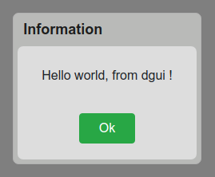

# dGUI - Interface elements generator including data and events handling

## Use cases
* Meteor applications (dGUI was developped in this context)
* Webapps
* Cloud computing platforms
## To whom is it addressed ?
* Developpers who want to focus on data and logic rather than graphics
* People who believe in "one task at a time design" philosphy
## Features
* View is entirely self-generated
* Clean and simple syntax
* A lot of code economy
* integrate well in any kind of environment
* form elements
* MDI elements
* modals
## Code examples
### Common dialog boxes
```javascript
dgui.alert("Hello world, from dgui !");

```
